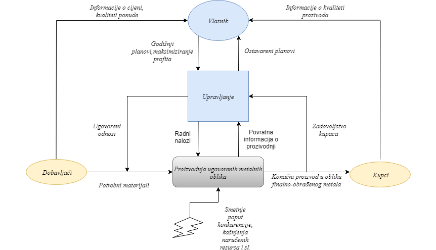
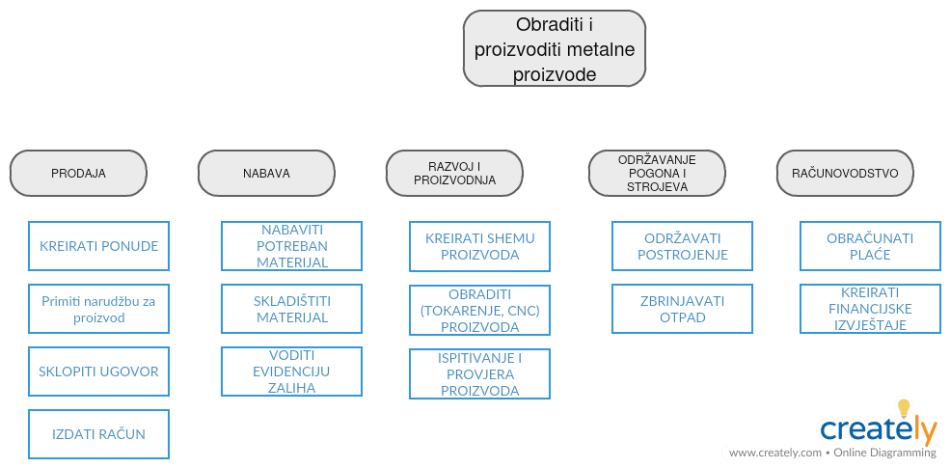
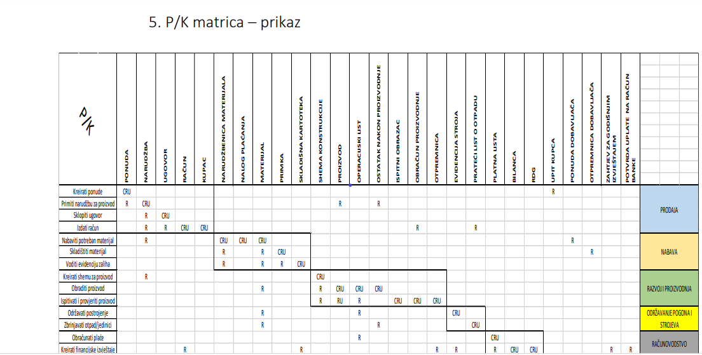
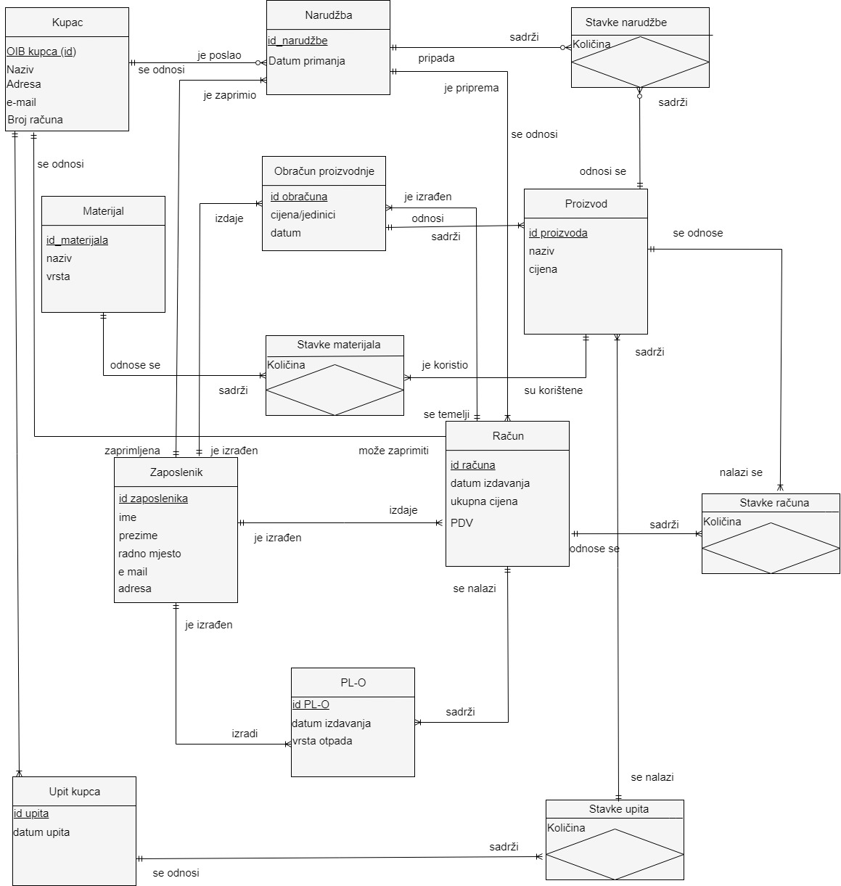

# **Workflow of my project**. _Enjoy_
## Project Summary

  The goal of this project is to implement all the steps needed to model processes and applications. The first step is to describe the levels of menangement and the business environment of the company through genetic defintion, p/c matrix, list of classes etc.
Next step involves modeling entities and relationships with ER tool.The final action includes the implementation of the application through the APEX system.

# Steps 

## First step : Genetic Defintion 

### What is Genetic defintion? 
  Genetic definition is sketch-based tool that is composed of : supliers, buyers, owner and informations between them.
### Why Genetic defintion? 
  Provides insight into management levels within a company.
  

## 2nd step : Process decomposition diagram (PDD)

### What is PDD? 
  PDD is a graphical representation of specific activities per process.
  

## 3rd step : Process/class matrix and workflow diagram

### What is p/c matrix? 
  P/C matrix is a tool to determinate relations between data class and company department.
### What is WFD 
  WFD shows us detailed flow between documents and materials.

## 4th step : E/R model

### What is E/R model? 
  E/R model is a set of attributes,entities and links.
  
### Parts of E/R model? 
  In this case, we have 13 tables, where there are 4 junction tables.
  

# FINAL IMPLEMENTATION 
 
(https://apex.oracle.com/pls/apex/f?p=90247:1:7958736161331:::::)

